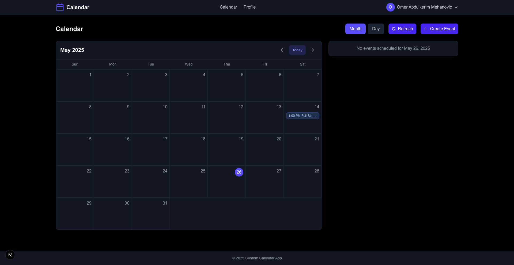

# Custom Calendar

A feature-rich calendar application built with Next.js that integrates with Google Calendar API. The application allows users to view, create and delete calendar events through an intuitive user interface with various view modes (day, week, month).

The application can be found [here](https://custom-calendar-taupe.vercel.app/).
It is deployed on Vercel.



## Overview

This custom calendar application provides a modern interface for managing your Google Calendar events. It features responsive design, multiple view options, and comprehensive event management capabilities. The app uses Google OAuth for authentication and directly integrates with the Google Calendar API to ensure your events stay synchronized.

## Technology Stack

### Frontend
- **Next.js 15**: App router architecture with React server components
- **TypeScript**: For type safety and better developer experience
- **Tailwind CSS**: For styling and responsive design
- **date-fns**: Library for date manipulation and formatting
- **React Context API**: For state management

### Backend
- **Next.js API Routes**: Server-side API handling
- **Google Calendar API**: For event management and synchronization
- **Authentication**: Google OAuth for secure user authentication

## Getting Started

### Prerequisites
- Node.js 20.0 or later
- npm, yarn, or pnpm package manager
- Google Cloud Platform account for OAuth credentials
- Google Calendar API enabled in your GCP project

### Installation

1. Clone the repository:
   ```bash
   git clone https://github.com/yourusername/custom-calendar.git
   cd custom-calendar
   ```

2. Install dependencies:
   ```bash
   npm install
   # or
   yarn install
   # or
   pnpm install
   ```

3. Set up environment variables (see [Google OAuth Setup](#google-oauth-setup) section)

4. Run the development server:
   ```bash
   npm run dev
   # or
   yarn dev
   # or
   pnpm dev
   ```

5. Open [http://localhost:3000](http://localhost:3000) with your browser

The application will redirect you to the login page. After authenticating with Google, you'll be redirected to the calendar interface.

## Project Structure

```
/app
  /api                 # API routes for server-side functionality
    /auth              # Authentication API endpoints
    /calendar          # Calendar API endpoints and event management
  /calendar            # Calendar page components
  /components          # Reusable UI components
    /auth              # Authentication-related components
    /calendar          # Calendar-specific components
    /layout            # Layout components (header, footer, etc.)
    /ui                # Generic UI components (buttons, dialogs, etc.)
  /contexts            # React contexts for state management
  /hooks               # Custom React hooks
  /services            # Service layer for API interactions
  /utils               # Utility functions
    /apiUtils.ts       # API response handling utilities
    /dateUtils.ts      # Date formatting and manipulation utilities
    /eventUtils.ts     # Event-related utilities
/public                # Static assets
```

P.S: I am aware that utils, services, hooks and similar directories usually go outside of app directory, but I preferred to keep them inside app directory for better organization.

## API Integration

### Google Calendar API

This application integrates with the Google Calendar API to provide calendar functionality. The integration is managed through a `CalendarService` class that handles all interactions with the Google Calendar API.

Key integration points:

1. **Authentication**: Uses OAuth2 tokens obtained during login
2. **Event Management**:
   - `fetchEvents`: Get all events within a date range
   - `createEvent`: Create a new calendar event
   - `updateEvent`: Update an existing event
   - `deleteEvent`: Delete an event
   - `getEventsForMonth`: Specialized endpoint for monthly view

### API Response Handling

The application uses a standardized API response format for consistent error handling and data management. The utilities in `apiUtils.ts` provide functions for:

- Success responses
- Error responses
- Authentication errors
- Validation errors

## Developer Guide

### Working with Calendar Views

The application offers multiple calendar views, each with its own component:

1. **DayView**: Shows events for a single day in a detailed format
2. **WeekView**: Displays a 7-day view with events
3. **MonthView**: Shows a traditional month calendar grid

All views use the `useCalendarView` hook which provides unified state management for:
- Current date
- Selected date
- View mode (day, week, month)
- Date range options
- Events loading and filtering

### Creating New Components

When creating new components:

1. Follow the existing component structure with clear separation of concerns
2. Use TypeScript for type safety
3. Use the reusable UI components in `/components/ui`
4. Utilize the hooks in `/hooks` for data fetching and state management

### Event Management

The event deletion process follows these steps:

1. User clicks delete button on an event
2. `ConfirmationDialog` component shows to confirm the action
3. On confirmation, `DeleteEventButton` calls the `deleteEvent` function from `useCalendar` hook
4. After successful deletion, the page reloads to show the updated calendar

## Google OAuth Setup

### 1. Create OAuth Credentials

1. Go to the [Google Cloud Console](https://console.cloud.google.com/)
2. Create a new project or select an existing one
3. Navigate to **APIs & Services > Credentials**
4. Click **Create Credentials** and select **OAuth client ID**
5. Set the application type to **Web application**
6. Add a name for your OAuth client
7. Add authorized JavaScript origins:
   - For development: `http://localhost:3000`
   - For production: `https://custom-calendar-taupe.vercel.app` (Or your custom domain)
8. Add authorized redirect URIs:
   - For development: `http://localhost:3000/api/auth/callback/google`
   - For production: `https://custom-calendar-taupe.vercel.app/api/auth/callback/google` (Or your custom domain)
9. Click **Create**

### 2. Configure Environment Variables

Create a `.env.local` file in the root of your project with the following variables:

```
GOOGLE_CLIENT_ID=your_client_id_here
GOOGLE_CLIENT_SECRET=your_client_secret_here
GOOGLE_REDIRECT_URI=http://localhost:3000/api/auth/callback/google
```

### 3. Running the Application

After setting up your Google OAuth credentials and environment variables, you can start the application using the commands in the Getting Started section.

## Deployment

### Vercel Deployment

This application is optimized for deployment on Vercel:

1. Push your code to a GitHub repository
2. Connect your repository to Vercel
3. Set the required environment variables in the Vercel dashboard:
   - `GOOGLE_CLIENT_ID`
   - `GOOGLE_CLIENT_SECRET`
   - `GOOGLE_REDIRECT_URI` (update for your production domain)
4. Deploy your application

### Environment Variables for Production

Make sure to update the following environment variables for your production environment:

```
GOOGLE_CLIENT_ID=your_client_id_here
GOOGLE_CLIENT_SECRET=your_client_secret_here
GOOGLE_REDIRECT_URI=https://your-domain.com/api/auth/callback/google
```

## Troubleshooting

### Common Issues

#### Authentication Problems

- **Issue**: Unable to login with Google
  - **Solution**: Verify your OAuth credentials and redirect URIs in Google Cloud Console

#### Calendar Events Not Loading

- **Issue**: Events not appearing in the calendar
  - **Solution**: Check if Google Calendar API is enabled in your Google Cloud project
  - **Solution**: Verify the token has the correct scopes for calendar access

#### Event Deletion Not Refreshing UI

- **Issue**: Deleted events still appear until page refresh
  - **Solution**: The app now forces a page reload after deletion to ensure UI consistency

### Debugging

The application uses console logging for debugging. Check your browser's developer console for any error messages when troubleshooting.

## Features

### Authentication
- Google OAuth authentication with secure token management
- Protected routes requiring authentication
- Automatic token refresh and session persistence
- Elegant handling of authentication errors

### Calendar Management
- Multiple calendar views: Day, Week, and Month
- Create, view, update, and delete events
- Real-time UI updates when events are modified
- Event details display with color coding
- Date and range selection for focused viewing
- Confirmation dialogs for destructive actions

### User Experience
- Responsive design that works on desktop and mobile devices
- Clean, modern UI with dark mode for reduced eye strain
- Intuitive navigation between different calendar views
- User profile management
- Loading states with spinners for better feedback
